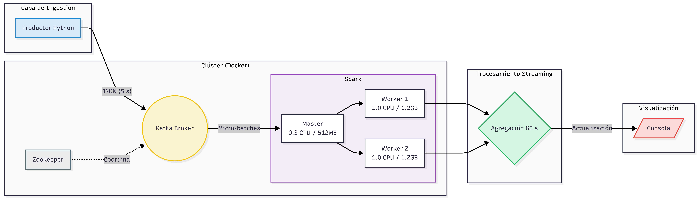
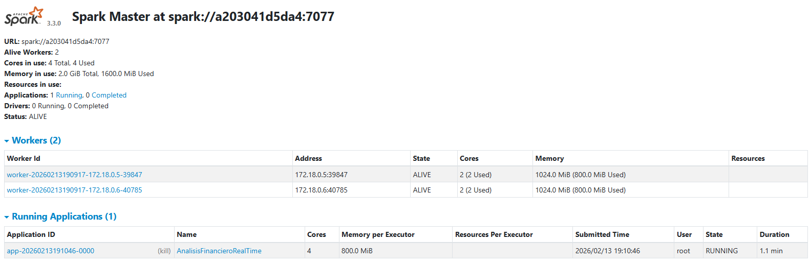
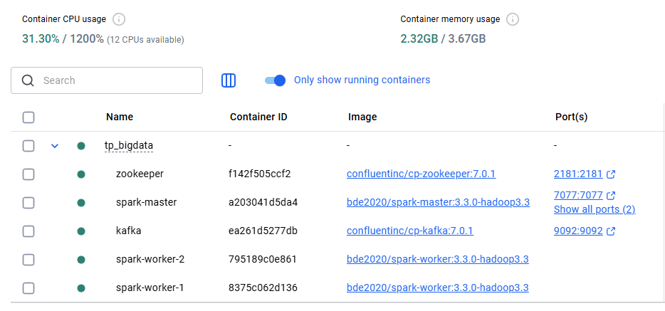
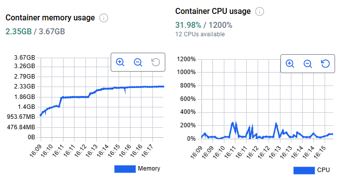
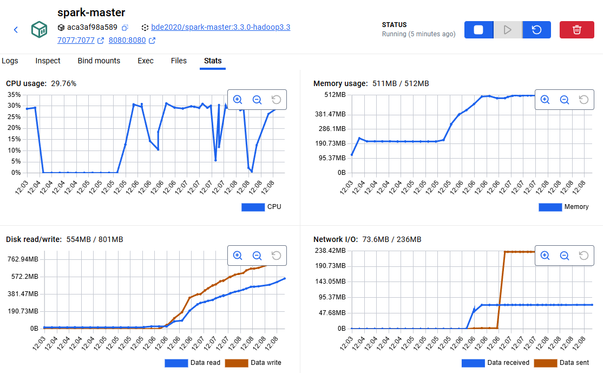

## Introducción

En el contexto del análisis de grandes volúmenes de datos, las arquitecturas distribuidas juegan un rol fundamental 
para el procesamiento eficiente y escalable de información. Tecnologías como Apache Spark y Apache Kafka se han convertido
en estándares para el procesamiento batch, streaming y la ingestión de datos en tiempo real.

El objetivo de este trabajo es diseñar e implementar un clúster virtualizado que permita simular una infraestructura 
orientada al análisis de datos del mercado financiero. Para ello, se utilizó Docker como tecnología de virtualización 
liviana, desplegando un clúster compuesto por tres nodos que integran Apache Spark, Apache Kafka y Apache Zookeeper.

El caso de uso se inspira en un concurso académico realizado en 2022, donde se propuso el análisis en tiempo real de datos 
de mercado. Dado que la API original ya no se encuentra disponible, se optó por simular la ingestión de datos utilizando 
Kafka como sistema de mensajería distribuido.

## Desarrollo

El sistema diseñado consta de tres niveles distintos y cinco nodos:

### Arquitectura de infraestructura

La implementación se basó en la tecnología de contenedores Docker, utilizando Docker Compose como orquestador para definir 
una red virtual aislada denominada *bigdata-network*. Esta red permite la comunicación entre nodos, garantizando un entorno 
reproducible y escalable.

- **Zookeeper**: servicio de coordinación para gestionar el estado del broker, las cuotas y, lo más importante, la elección de líderes para las  particiones de los temas (topics).

```{r, eval=FALSE}
  zookeeper:
    image: confluentinc/cp-zookeeper:7.0.1
    container_name: zookeeper
    ports:
      - "2181:2181"
    environment:
      ZOOKEEPER_CLIENT_PORT: 2181
      ZOOKEEPER_TICK_TIME: 2000
    networks:
      - bigdata-network
```

- **Kafka**: encargado de la ingestión y distribución de eventos que simulan datos del mercado financiero, que describiremos más adelante.
Fue configurado con múltiples *listeners* para diferenciar el tráfico interno del clúster y el tráfico externo de los productores de datos.

```{r, eval=FALSE}
  kafka:
    image: confluentinc/cp-kafka:7.0.1
    container_name: kafka
    depends_on:
      - zookeeper
    ports:
      - "9092:9092"
    environment:
      KAFKA_BROKER_ID: 1
      KAFKA_ZOOKEEPER_CONNECT: zookeeper:2181
      KAFKA_LISTENER_SECURITY_PROTOCOL_MAP: INTERNAL:PLAINTEXT,EXTERNAL:PLAINTEXT
      KAFKA_ADVERTISED_LISTENERS: INTERNAL://kafka:29092,EXTERNAL://localhost:9092
      KAFKA_INTER_BROKER_LISTENER_NAME: INTERNAL
      KAFKA_OFFSETS_TOPIC_REPLICATION_FACTOR: 1
    networks:
      - bigdata-network
```


- **Spark**: Tendremos un nodo maestro (*Master*), que no procesa datos directamente sino que su función es asignarle tareas a los nodos trabajadores (*Workers*) y
gestionar el ciclo de vida de las aplicaciones Spark. Estos últimos recibirán las divisiones del trabajo realizadas por el master, llamadas *tasks*, para ejecutarlas 
y devolver los resultados.

```{r, eval=FALSE}

  spark-master:
    image: bde2020/spark-master:3.3.0-hadoop3.3
    container_name: spark-master
    ports:
      - "8080:8080"
      - "7077:7077"
    environment:
      - PYSPARK_PYTHON=python3
    deploy:
      resources:
        limits:
          cpus: '0.30' 
          memory: 512M
    networks:
      - bigdata-network

  # Dos spark-workers idénticos con la misma estructura
  spark-worker:
    image: bde2020/spark-worker:3.3.0-hadoop3.3
    container_name: spark-worker-1
    depends_on:
      - spark-master
    environment:
      - SPARK_MASTER_URL=spark://spark-master:7077
      - SPARK_WORKER_CORES=2
      - SPARK_WORKER_MEMORY=1024m
    deploy:
      resources:
        limits:
          cpus: '1.0'
    networks:
      - bigdata-network
```

La virtualización mediante Docker permitió cumplir con el requerimiento sin necesidad de máquinas virtuales completas, reduciendo el consumo de recursos y simplificando el despliegue. De todas formas, la separación de roles y la limitación estricta de recursos mediante contenedores posibilitaron la estabilidad del sistema, evitando la sobrecarga.

### Simulación de datos financieros

Ante la falta de una fuente de datos externa, se desarrolló un productor de datos en Python. Este código parte de los valores de las acciones al 12/02/2026, simulando la volatilidad del mercado financiero mediante *random walk*, generando registros en formato JSON que incluyen: la fecha, el símbolo de la acción correspondiente y su precio unitario. Sus variaciones porcentuales fueron ajustadas para garantizar cierto grado de realismo, estando contenidas en un rango entre el -0.1% y el 0.1%, con una distribución uniforme, por lo que no tendrán una tendencia intrínseca a bajar o subir. Además, se ajustó la frecuencia de publicación a intervalos de cinco segundos, permitiendo evaluar la capacidad de respuesta del sistema ante flujos continuos.

```{r, eval=FALSE}

producer = KafkaProducer(
    bootstrap_servers=['localhost:9092'],
    value_serializer=lambda v: json.dumps(v).encode('utf-8')
)

topic_nombre = "precios_mercado"
acciones = ['AAPL', 'TSLA', 'GOOG', 'AMZN', 'MSFT']
precios = {
    "AAPL": 267.0,
    "MSFT": 399.0,
    "GOOG": 310.0,
    "AMZN": 197.0,
    "TSLA": 423.0
}

print(f" Iniciando envío de datos al tópico: {topic_nombre}")

try:
    while True:
        for accion in acciones:
            variacion = precios[accion] * random.uniform(-0.001, 0.001)
            precios[accion] += variacion
            
            mensaje = {
                'timestamp': time.time(),
                'simbolo': accion,
                'precio': round(precios[accion], 2)            }
            
            producer.send(topic_nombre, value=mensaje)
            print(f"Enviado: {mensaje}")
            
        time.sleep(5)  
        
except KeyboardInterrupt:
    print("\n Simulación detenida por el usuario.")
finally:
    producer.close()

```


### Procesamiento en tiempo real

El procesamiento se realiza mediante Spark Structured Streaming, una API que permite tratar los flujos de datos como tablas. El motor de Spark consume los mensajes desde Kafka utilizando el conector especializado *spark-sql-kafka*. La lógica de procesamiento implementa una agregación contínua por activo financiero para calcular métricas en tiempo real, como el precio promedio. Para garantizar la integridad de los datos, se integró una política de marcas temporales de 60 segundos, lo que permite al motor de Spark gestionar el estado de los eventos y tolerar retrasos en la llegada de la información sin comprometer la estabilidad de la memoria del clúster.

Dada la naturaleza del entorno virtualizado y la restricción de recursos computacionales, se configuró el intercambio de datos a través de la red virtual (*shuffling*), reduciendo la fragmentación de tareas y alineando el número de particiones con la cantidad de núcleos asignados a los nodos trabajadores anteriormente. 

Asimismo, se aplicó una estrategia de optimización de la capa de presentación para mejorar la legibilidad de los resultados en consola. Esto se logró mediante el modo de salida *Update*, que permite que el sistema solo emita aquellos registros que han sufrido cambios (reduciendo la redundancia visual), y una transformación de datos para redondear los valores y se eliminaron los metadatos temporales de las ventanas.

```{r, eval=FALSE}

spark = SparkSession.builder \
    .appName("AnalisisFinancieroRealTime") \
    .config("spark.sql.shuffle.partitions", "2") \
    .config("spark.default.parallelism", "2") \
    .config("spark.executor.memory", "800m") \
    .getOrCreate()

spark.sparkContext.setLogLevel("WARN")

schema = StructType([
    StructField("timestamp", DoubleType()),
    StructField("simbolo", StringType()),
    StructField("precio", DoubleType())
])

df_crudo = spark.readStream \
    .format("kafka") \
    .option("kafka.bootstrap.servers", "kafka:29092") \
    .option("subscribe", "precios_mercado") \
    .option("startingOffsets", "latest") \
    .load()

df_json = df_crudo.selectExpr("CAST(value AS STRING)") \
    .select(from_json(col("value"), schema).alias("data")) \
    .select("data.*")

df_formateado = df_json \
    .withColumn("event_time", col("timestamp").cast(TimestampType())) \
    .withWatermark("event_time", "1 minute")

df_simbolo = df_formateado \
    .groupBy("simbolo") \
    .agg(avg("precio").alias("precio_promedio")) \
    .select(
        col("simbolo"), 
        col("precio_promedio").cast("decimal(10,2)") 
    )

query = df_simbolo.writeStream \
    .outputMode("update") \
    .format("console") \
    .option("truncate", "false") \
    .start()

query.awaitTermination()

```



## Pruebas

En primer lugar, se verificó el correcto funcionamiento de cada componente: accedimos exitosamente a la interfaz web de Spark, permitiendo confirmar que el Master y sus correspondientes Workers se encontraban activos. En cuanto al Broker de Kafka, verificamos la conectividad de los *listeners* mediante el listado de tópicos activos a través del puerto expuesto y confirmando que la red interna de Docker y el broker estaban operativos. En cuanto a Zookeeper, la verificación resulta indirecta, a través del correcto funcionamiento de Kafka.





En segundo lugar, a través del panel de estadísticas de Docker Desktop, se monitoreó el estado del clúster y su comportamiento durante la ejecución del pipeline para validar la eficiencia de la arquitectura. De esta manera, pudimos comprobar que ningún servicio (Kafka, Zookeeper o Spark) sufrió reinicios inesperados. Además, se confirmó que los límites de recursos impuestos en el archivo `docker-compose.yml` fueron respetados, evitando que el proceso de Spark interfiriera con el rendimiento del sistema operativo más allá de algunos picos de utilización de CPU. A su vez, la comunicación entre el contenedor de Kafka y los nodos de Spark se mantuvo estable, con una latencia mínima de red interna.

{height=200px}

{height=200px}

En tercer y último lugar, como prueba de integración de la arquitectura propuesta, se procedió a la puesta en marcha del ecosistema distribuido. Esta etapa constituyó una prueba funcional de extremo a extremo, permitiendo verificar que el flujo de datos no presentaba cuellos de botella ni errores de incompatibilidad o codificación entre el productor Python (externo) y el consumidor Spark (interno al clúster). Este procedimiento valida que el clúster fue capaz de manejar eventos en tiempo real, cumpliendo con el objetivo de simular una arquitectura de streaming de datos. Así, los resultados obtenidos en las consolas de salida confirman el correcto funcionamiento del ciclo de vida del dato, logrando una visión un poco más clara del mercado financiero simlulado, cuya visualización es ejemplificada por el siguiente batch:

```text

-------------------------------------------
Batch: 49
-------------------------------------------
+-------+---------------+
|simbolo|precio_promedio|
+-------+---------------+
|AAPL   |268.21         |
|GOOG   |309.23         |
|AMZN   |196.95         |
|TSLA   |420.93         |
|MSFT   |399.46         |
+-------+---------------+

```

## Conclusiones

El presente proyecto permitió el diseño y la implementación de un ecosistema de streaming de grandes volúmenes de datos, logrando la transición desde una simulación de datos aislada hacia un flujo de procesamiento distribuido y un análisis en tiempo real. 

El uso de Apache Kafka como broker de mensajes demostró ser una solución consistente para el desacoplamiento entre productores y consumidores de datos. Esta arquitectura permitió que la variabilidad en la recepción de datos financieros no afectara la estabilidad de los nodos de cómputo (*workers*), garantizando la integridad de los mensajes.

Además, la implementación de Docker Compose facilitó un entorno controlado y reproducible. La asignación de límites de hardware (CPU y RAM) demostró que es posible ejecutar cargas de trabajo considerables de Spark en entornos con recursos limitados, siempre que los parámetros sean debidamente configurados (como el particionamiento y la gestión de memoria de los workers).

En el mismo sentido, el uso de la trasmisión de datos estructurados de Spark permitió transformar datos crudos en información de valor con una latencia mínima. Mediante su capacidad de escalamiento horizontal, el incremento en el volumen de información incorporando nuevos activos podría ser solucionado mediante la adición de nodos al clúster, sin comprometer la arquitectura diseñada.

Desde ya, la implementación presentada no estuvo exenta de dificultades: fue necesario un esfuerzo considerable para resolver errores de configuración de los *listeners* de Kafka, así como los desbalances en el procesamiento por lotes de Spark originados por tiempos de ejecución que excedían los intervalos de activación configurados. Cada uno de estos inconvenientes permitió profundizar en el entendimiento del funcionamiento interno de las herramientas utilizadas.

## Trabajo a futuro

Creemos que la arquitectura desarrollada sienta las bases para un sistema de análisis financiero más robusto. En ese camino, la transición desde datos simulados hacia bases de datos de mercado o APIs en tiempo real podrían representar un avance interesante, al tener que enfrentar desafíos de ETL como la normalización de formatos heterogéneos en condiciones de alta velocidad, la gestión de volúmenes de datos considerablemente mayores o la limpieza de datos para eliminar ruido o anomalías en intervalos infinitesimales. 

Otro avance podría ser la incorporación de variables estadísticas e indicadores técnicos que permitan tener más información para la toma de decisiones. Cálculos de volatilidad, correlaciones entre activos o la detección de patrones y señales de compra o venta mediante modelos de Machine Learning podrían ser valiosos complementos para enriquecer el análisis.

Finalmente, para transformar los resultados de la consola en información interpretable, se requiere una capa de visualización dinámica, que podría saldarse mediante la creación de tableros que consuman directamente los resultados procesados por la arquitectura. Así, podrían configurarse sistemas de alerta o notificaciones cuando las señales del mercado superen umbrales de riesgo predefinidos.

## Referencias

